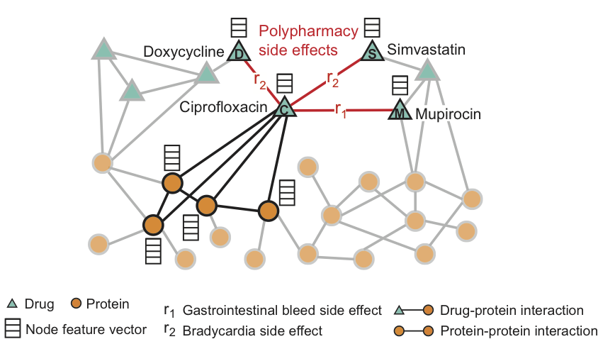

# CoAttentionGraphPooling
Repository for the paper, 
This repository provides an implementation of Co-Attention Graph Pooling (CAGPool) model in the paper 'Co-attention Graph Pooling for Efficient Pairwise Graph Interaction Learning' using PyTorch and the PyTorch Geometric library. 


## Requirements
- Python 3.7 or higher
- PyTorch 1.7.0 or higher
- PyTorch Geometric
- numpy
- scipy

```bash
# Create rdkit environment
$ conda create -c rdkit -n rdkit-env python=3.6 rdkit
$ conda activate rdkit-env
$ pip install pubchempy

# PyTorch 1.3.1
$ conda install pytorch torchvision cudatoolkit=10.1 -c pytorch

# PyTorch Geometric
$ pip install --verbose --no-cache-dir torch-scatter
$ pip install --verbose --no-cache-dir torch-sparse
$ pip install --verbose --no-cache-dir torch-cluster
$ pip install --verbose --no-cache-dir torch-spline-conv (optional)
$ pip install torch-geometric

# PyYaml
$ pip install pyyaml
```

## Dataset
This implementation uses datasets stored in pickle format. The dataset should contain two kinds of information:
- The feature matrix of the nodes
- The adjacency matrices for each edge type

<p align="center"></p>

Download the dataset from the official [website](http://snap.stanford.edu/decagon/).
Dataset processing is handled by the `DecagonDataset_binary` and `DecagonDataset_multi` classes based on the selected label type (binary or multi).


## Setup

You need to create a configuration file (cfg) with all the necessary parameters and paths. The configuration file includes parameters for:

- Dataset paths
- Training parameters (e.g., learning rate, weight decay)
- Model parameters
- Whether you will use binary or multi label type
- Loss function choice


## Usage

To run the training phase:

```bash
python main.py --cfg path/to/config --phase train
```


To run the testing phase:

```bash
python main.py --cfg path/to/config --phase test
```


## Output

After running the script, the trained model will be saved to the directory specified in the configuration file. During the testing phase, the Area Under the Receiver Operating Characteristic (AUROC), Area Under Precision Recall Curve (AUPRC), and Average Precision at 50 (AP50) will be printed to the console.

